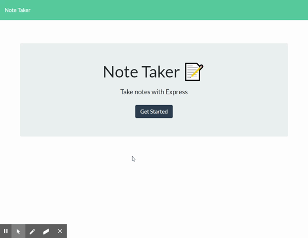

# Note Taker
This application helps you take notes! It allows you to assign a note name and text, and press save to store it in a list for later viewing. Once you are done with the note you can press the delete button which removes the note from the list. The page comes with a starter note to help demonstrate page use.



## Table of Contents

||||
|:-|:-|:-|:-|:-
| [Project Introduction](#note-taker) | [Table of Contents](#table-of-contents) | [Goals and Methods](#goals-and-methods) 
| [Installation and Use](#installation-and-use) | [Technologies](#technologies) | [Deployed Link](#deployed-link) |
| [Authors](#authors) | [Acknowledgments](#acknowledgments) | [License](#license) |
---

## Goals and Methods

This project had the following learning objectives:
* Provided the completed front-end, create and link an Express server
* Explore Express
* Deploy a site to Heroku

The complete front end of the site was provided by UC Berkeley CodeCamp staff. This provided an opportunity to build an Express server that had to fit a set of contraints which allowed the project to focus entirely on backend development. The main challenge and major learning opportunity was reading and understanding someone else's code in order to build a complementary backend capable of handling ajax requests. The first roadblock encountered was ensuring that all the static files (CSS, images, and JS) that make up the page were actually being served back to the client. This was handled with the following:
```javascript
app.use(express.static(path.join(__dirname, 'public')));
```
With the static files being served to the page the major task of handling routes was developed. The front end required five routes:
* A get route to read a JSON file that stored all the notes,
* A get route to be served the notes.html page,
* A get route to be served the index.html page,
* A post route to add notes to the aforementioned JSON file, and
* A delete route to remove a note.

The takeaway lessons from making these paths:
* Using a wildcard route requires that route to be the last GET, otherwise you can't access the other GET routes 
```javascript
 app.get('*', function(req, res) {
	res.sendFile(path.join(__dirname, '/public/index.html'));
});
```
* When generating unique identifiers for HTML elements avoid using 0 (zero). It creates problems that are easily avoided by incrementing all ID's by one. This action is easy to account for later in the process as you can subtract 1 to match ID's with their index value in an array. Assigning an ID to each element in an array of note objects:
```javascript
	for (let i = 0; i < db.length; i++) {
		db[i].id = i + 1;
```
Targeting a specific ID and removing it from the same array of objects:
```javascript
	db.splice(req.params.id-1,1);
```


Site hosting infrastructure is handled by Heroku and was simple to learn to use. Heroku has a command line interface (CLI) that dovetails nicely with git. The first steps are to create an account, install the CLI package, and link your account to the local CLI installation. Once that is done you can type 'heroku create' inside a git tracked folder to create an a new app. For reference the app name will appear in your online Heroku account dashboard. In order to deploy to Heroku your git repository needs to be current. Once it is  type 'git push heroku main'. Now that heroku has the site content you can type 'heroku open' to have the site opened in a browser for viewing. 

## Installation and Use

This project requires the use of Node.js and Express. Once you have Node.js installed navigate to the project directory and check to see if package.json exists. If it does, type 'npm install', otherwise type 'npm init -y' followed by 'npm install express'. With these installed you can type 'node server.js' and open a browser to view the page. By default the page can found at the URL localhost:3000.

## Technologies 

* [HTML](https://developer.mozilla.org/en-US/docs/Web/HTML)
* [CSS](https://developer.mozilla.org/en-US/docs/Web/CSS)
* [Javascript](https://developer.mozilla.org/en-US/docs/Web/JavaScript)
* [Node.js](https://nodejs.org/en/)
* [Express](https://expressjs.com/)
* [Heroku](https://heroku.com/)

## Deployed Link

[Deployed on Heroku](https://note-taker-cb.herokuapp.com/)

## Authors

Coleman Buffa

* [Git Hub](https://github.com/coleman-buffa/note-taker)
* [LinkedIn](https://www.linkedin.com/in/coleman-buffa/)

## Acknowledgments

My thanks to the many mentors and friends who are a constant source of project ideas, learning topics, and guidance.

## License

[](https://opensource.org/licenses/MIT)

### [Back to Table of Contents](#table-of-contents)